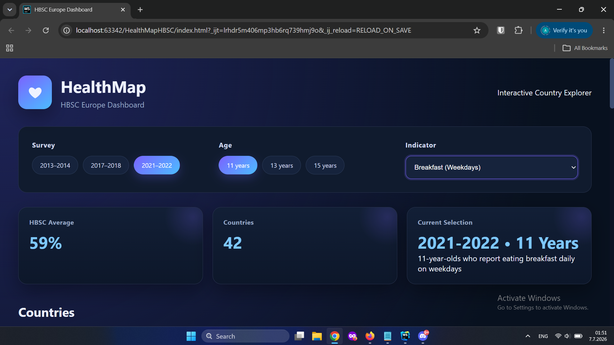
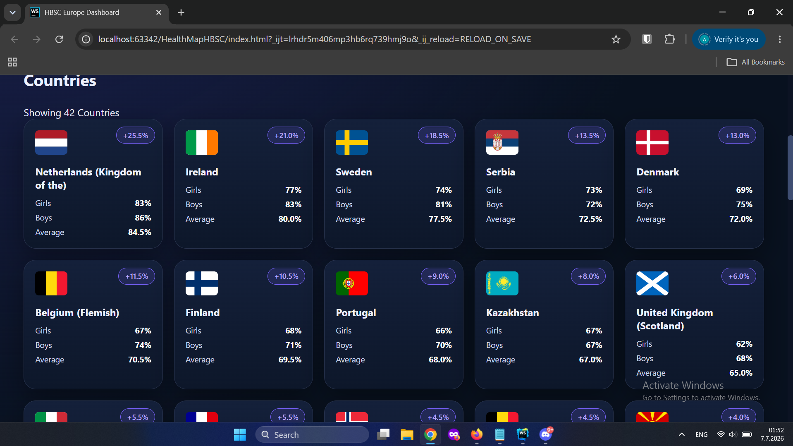
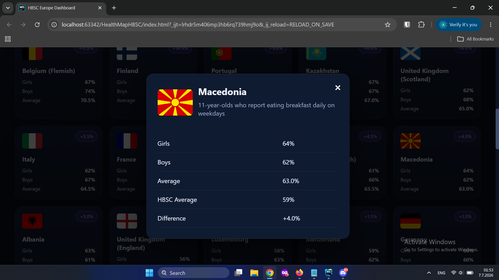
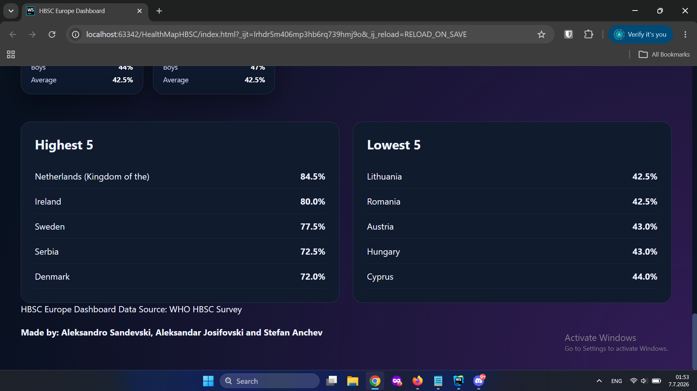

# HealthMap – HBSC Europe Dashboard

Interactive dashboard for exploring Health Behaviour in School-aged Children (HBSC) survey data across European countries.

---

# Overview

HealthMap is a lightweight frontend web application developed to present selected indicators from the WHO Health Behaviour in School-aged Children (HBSC) survey in an interactive and accessible way.

The application allows users to compare survey results between European countries using simple visual cards, country flags, rankings and summary statistics.

The project was intentionally implemented as a static web application without a backend or database. All data are stored locally in JSON files and loaded dynamically depending on the selected survey year, age group and indicator.

---

# Features

- Survey year selection
- Age group selection (11, 13 and 15 years)
- Indicator/category selection
- Automatic loading of JSON datasets
- Country overview cards
- Country flags
- HBSC average calculation
- Top 5 and Bottom 5 country rankings
- Detailed country information in a modal window
- Automatic handling of unavailable datasets
- Responsive layout

---

# Application Preview

## 1. Main dashboard



The upper section of the application contains:

- Survey selection
- Age selection
- Indicator selection from a dropdown menu
- HBSC summary information

---

## 2. Country overview



Each country is represented as a card displaying:

- National flag
- Country name
- Girls percentage
- Boys percentage
- Average percentage
- Difference from the HBSC average

---

## 3. Country details



Selecting/Clicking a country opens a detailed information window showing:

- Country flag
- Indicator title
- Girls percentage
- Boys percentage
- Country average
- HBSC average
- Difference from the HBSC average

---

## 4. Rankings



The lower section displays:

- Top 5 countries
- Bottom 5 countries

according to the selected indicator.

---

# Folder Structure

```
HealthMapHBSC/

│

├── index.html

├── css/

│   └── style.css

│

├── js/

│   └── app.js

│

├── data/

│   ├── 2013-2014/

│   ├── 2017-2018/

│   └── 2021-2022/

│

├── assets/

│   └── flags/
├
├
├── images/

└── README.md
```

---

# Data Organisation

Survey data are stored as JSON files.

Folder hierarchy:

```
Year
    └── Age
            └── Indicator.json
```

Example:

```
data/

└── 2021-2022/

      └── 11/

            ├── breakfast-weekday.json

            ├── fruit-daily.json

            ├── overweight-obese.json

            └── ...
```

Each JSON file contains:

- Indicator title
- Unit
- Country values
- Girls percentage
- Boys percentage
- HBSC average

The application loads the appropriate file automatically depending on the selected filters.

---

# Technologies

- HTML5
- CSS3
- JavaScript (ES6)
- JSON

No external libraries or frameworks were used.

---

# Running the Application

No installation is required.

Option 1 (recommended)

Open the project using IntelliJ IDEA or WebStorm and run `index.html` using the built-in web server.

Option 2

Serve the project using any local web server, for example:

```
python -m http.server
```

and open

```
http://localhost:8000
```

in your web browser.

---

# How to Use

1. Select a survey year.
2. Select an age group.
3. Choose an indicator.
4. Browse the country cards.
5. Click on a country to display detailed statistics.
6. Compare countries using the Top 5 and Bottom 5 rankings.

Unavailable indicators are automatically disabled depending on the selected survey year and age group.

---

# Data Source

Health Behaviour in School-aged Children (HBSC)

World Health Organization (WHO)

The presented values originate from publicly available HBSC survey reports.

---

# Authors

Developed as a university project for the School-Age Psychology course at FCSE.

Frontend implementation using HTML, CSS and JavaScript.

Made by: Aleksandro Sandevski, Aleksandar Josifovski and Stefan Anchev